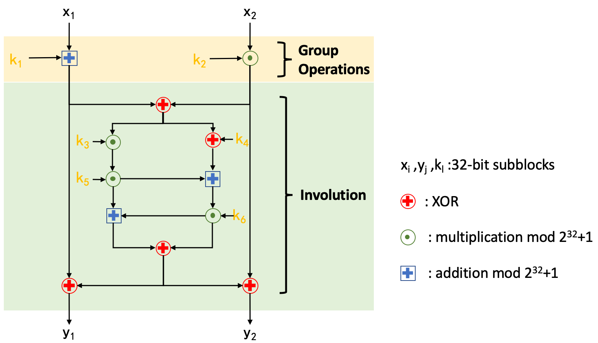

# 0CTF/TCTF 2021 Final 0bf WriteUp

-  [English](./README_en.md)


## 概述

Rev, 

0CTF/TCTF: 1 solves, 1000 points

RisingStarCTF: 2 solves, 750 points


本题是一个比较直观的逆向题目，选手需要输入正确的字符串，使其通过加密后的密文与程序中硬编码的值相等，主要难点在于使用了Mixed Boolean-Arithmetic (MBA)混淆。

本题希望考察选手对MBA混淆的解混淆能力，以及对自实现分组密码的分析能力。题目中使用MBA对自实现分组密码的运算进行了混淆，选手可以在提取MBA表达式之后使用手动或自动化的方法解混淆并逆向分组密码。


### 预期解法

- 提取加密函数中的逻辑，可使用修改配置的IDA Pro进行反编译（等待几十分钟），或者编写脚本提取表达式
- 发现为循环展开，提取出单轮中的操作
- 根据数据依赖关系及使用的操作数等特征，提取出正确的MBA表达式
- 通过手动分析或自动化解混淆，分析出MBA表达式的简单形式
- 分析加密算法逻辑，提取轮密钥，编写解密算法，并计算flag


其中主要涉及两个部分：

- MBA混淆
- 自实现分组密码


### MBA混淆

> Mixed Boolean-Arithmetic (MBA) obfuscation is a method to perform a semantics-preserving transformation from a simple expression to a representation that is hard to understand and analyze.<sup>[1]</sup>

举个例子<sup>[1]</sup>：

```c
4∗(¬x∧y)−(x⊕y)−(x∨y)+4∗¬(x∨y)−¬(x⊕y)−¬y−(x∨¬y)+1+6∗x+5∗¬z+(¬(x⊕z))−(x∨z)−2∗¬x−4∗(¬(x∨z))−4∗(x∧¬z)+3∗(¬(x∨¬z)) 

= 4∗(y−(x∧y))−(x+y−2∗(x∧y))−(x+y−(x∧y))+4∗(−x−y+(x∧y)−1)−(−x−y+2∗(x∧y)−1)−(−y−1) −(−y+(x∧y)−1)+1+6∗x+5∗(−z−1)+(−x−z+2∗(x∧z)−1)−1∗(x+z−(x∧z))−2∗(−x−1) −4∗(−x−z+(x∧z)−1)+3∗(z−(x∧z))−4∗(x−(x∧z)) 

= 4∗y−4∗(x∧y)−x−y+2∗(x∧y)−x−y+(x∧y)−4∗x−4∗y+4∗(x∧y)−4+x+y−2∗(x∧y)+1+y+1+y(x∧y)+1+1+6∗x−5∗z−5−x−z+2∗(x∧z)−1−x−z+(x∧z)+2∗x+2+4∗x+4∗z−4∗(x∧z)+4+3∗z −3∗(x∧z)−4∗x+4∗(x∧z) 

= x+y
```

题目中使用宏定义对MBA表达式进行了封装，可以使用`gcc -E ./chall.c -o out.txt`查看宏定义展开后的表达式。

MBA表达式中可能存在一些不会影响表达式语义的变量，本题中使用了一些随机数、未初始化变量及中间变量参与运算，干扰选手对数据流的分析。

选手可以从二进制程序中提取出正确的MBA表达式之后，使用手动分析（guessing），或者自动化分析（z3、MBA-Blast、Arybo、SSPAM等方案），这里主要推荐发表在USENIX Security 2021的[MBA-Blast](https://github.com/softsec-unh/MBA-Blast) [1]（[简要论文阅读笔记](https://gange666.github.io/2021/07/30/paper_notes/2021-0730-MBA-Blast%20d220340051004feda83956c138a53104/)），其他方案可能存在开销过高、化简后形式较为复杂、化简不准确等问题。


### 自实现分组密码

本题中实现了一个自定义的分组密码，block大小为64bit，十轮，每轮使用6个32bit的轮密钥。主要是参考IDEA中所使用的MA结构，设计了一个Encrypt/Decrypt similarity密码算法，主要分为Group Operations、Involution两个阶段。选手需要参考加密算法实现解密算法。

该算法中每轮结构如下：



具体代码可以参考`solver/solver.c`。


### 引用

[1] Liu B, Shen J, Ming J, et al. MBA-Blast: Unveiling and Simplifying Mixed Boolean-Arithmetic Obfuscation[C]//30th {USENIX} Security Symposium ({USENIX} Security 21). 2021.