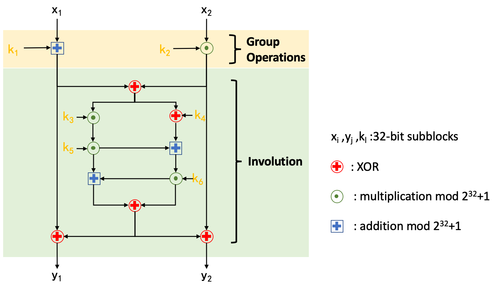

# 0CTF/TCTF 2021 Quals 0bf WriteUp

- [中文](./README.md)


### Overview

Rev, 

0CTF/TCTF: 1 solves, 1000 points

RisingStarCTF: 2 solves, 750 points


This challenge is a relatively conventional reverse challenge. You need to enter the correct string so that the cipher text is equal to the hard-coded value in the binary. The main difficulty lies in the use of **Mixed Boolean-Arithmetic (MBA)** obfuscation.

This challenge examines the contestant's ability to resolve MBA obfuscation and the ability to analyze custom block cipher. The operations in custom block cipher is obfuscate by MBA obfuscation. So you need to use manual or automated methods to resolve the obfuscation and analyze the block cipher.


### Intended Solution

- To extract the logic in the encrypted function, you can use the IDA Pro with the modified configuration to decompile (wait tens of minutes), or write a script to extract the expressions
- Found that the loop is unrolled, and extract the operations in a single round
- Extract the correct MBA expressions based on data dependent features such as the operand used in the expression
- Analyze the simple form of MBA expression through manual analysis or automatic de-obfuscation
- Analyze the encryption algorithm logic, extract the round key, write the decryption algorithm, and calculate the flag!


### MBA Obfuscation

> Mixed Boolean-Arithmetic (MBA) obfuscation is a method to perform a semantics-preserving transformation from a simple expression to a representation that is hard to understand and analyze.<sup>[1]</sup>

For example<sup>[1]</sup>：

```c
4∗(¬x∧y)−(x⊕y)−(x∨y)+4∗¬(x∨y)−¬(x⊕y)−¬y−(x∨¬y)+1+6∗x+5∗¬z+(¬(x⊕z))−(x∨z)−2∗¬x−4∗(¬(x∨z))−4∗(x∧¬z)+3∗(¬(x∨¬z)) 

= 4∗(y−(x∧y))−(x+y−2∗(x∧y))−(x+y−(x∧y))+4∗(−x−y+(x∧y)−1)−(−x−y+2∗(x∧y)−1)−(−y−1) −(−y+(x∧y)−1)+1+6∗x+5∗(−z−1)+(−x−z+2∗(x∧z)−1)−1∗(x+z−(x∧z))−2∗(−x−1) −4∗(−x−z+(x∧z)−1)+3∗(z−(x∧z))−4∗(x−(x∧z)) 

= 4∗y−4∗(x∧y)−x−y+2∗(x∧y)−x−y+(x∧y)−4∗x−4∗y+4∗(x∧y)−4+x+y−2∗(x∧y)+1+y+1+y(x∧y)+1+1+6∗x−5∗z−5−x−z+2∗(x∧z)−1−x−z+(x∧z)+2∗x+2+4∗x+4∗z−4∗(x∧z)+4+3∗z −3∗(x∧z)−4∗x+4∗(x∧z) 

= x+y
```

I use several macros to encapsulate the MBA expressions. You can use `gcc -E ./chall.c -o out.txt` to view the expanded expressions.

There may be some variables in the MBA expression that do not affect the semantics of the expression. In this challenge, some random numbers, uninitialized variables and intermediate variables are used in the calculation, which interferes with the analysis of the data flow.

You can use manual analysis (guessing) or automated analysis (z3, MBA-Blast, Arybo, SSPAM, etc.) after extracting the correct MBA expression from the binary. I recommend to use [MBA -Blast](https://github.com/softsec-unh/MBA-Blast) [1] which is published in USENIX Security 2021, other solutions have limits such as high overhead, simplified form still too complicated, and inaccurate reduction.


### Custom Block Cipher

A custom block cipher is implemented in this challenge, with a block size of 64 bits, ten rounds, and each round uses six 32-bit round keys. Mainly referring to the MA structure used in IDEA, and it is an Encrypt/Decrypt similarity cryptographic algorithm, which is mainly divided into two stages: Group Operations and Involution. Players need to refer to the encryption algorithm to implement the decryption algorithm.

The structure of each round in the algorithm is as follows:



The solution can refer to `solver/solver.c`.


### Reference

[1] Liu B, Shen J, Ming J, et al. MBA-Blast: Unveiling and Simplifying Mixed Boolean-Arithmetic Obfuscation[C]//30th {USENIX} Security Symposium ({USENIX} Security 21). 2021.