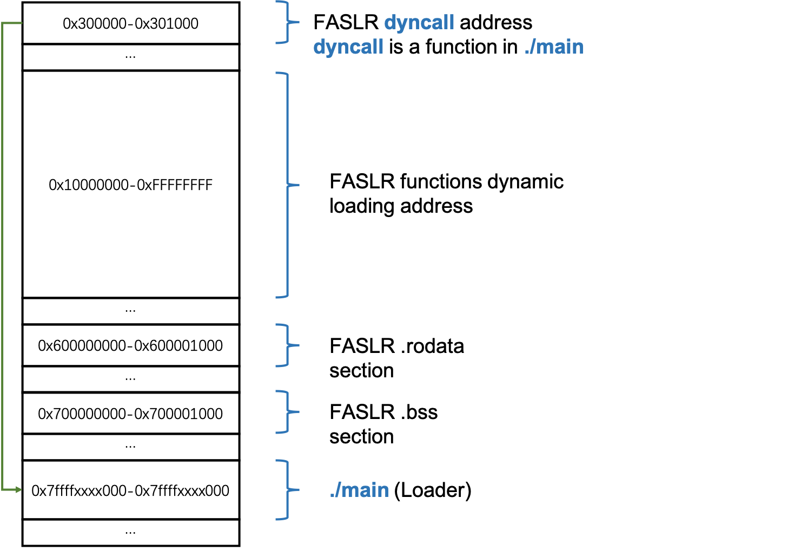
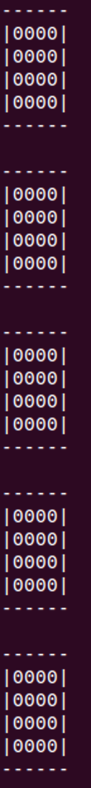
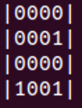
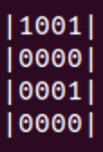
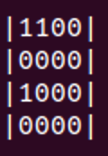
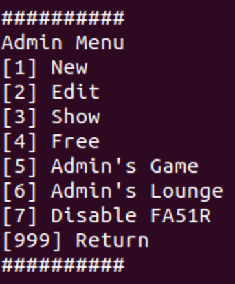

# 0CTF/TCTF 2021 Quals FA51R_RE & FA51R_PWN WriteUp

- [English](./README_en.md)


[TOC]

## 基本信息

**FA51R_RE**

Rev, 10 solves, 550 points

**FA51R_PWN**

Pwn, 0 solves, 1000 points


## 概述

FA51R的全称是Function level Address Space Layout Randomization（FASLR）。

- _RE：选手需要通过逆向二进制俄罗斯方块小游戏并完成挑战，以通过第一关并获得admin权限、FA51R_RE的flag和FA51R_PWN文件的解压密码。
- _PWN：admin菜单中提供了增删查改、\_RE的可视化版本小游戏、设置随机数种子、关闭动态加载函数（虽然并不是真的关闭），共七个功能。

**漏洞位置**：关闭动态加载函数时会检查mmap的第一个参数（希望分配到的地址）与mmap的返回值（实际分配的地址）是否相同，以达到Randomization的目的。在检查不相等时会进入到错误处理分支，在这个Error Handling Code中封装了两个清理函数，其中存在一个double free漏洞。


## 设计思路

### FASLR

我们最常见的ASLR机制，以module为粒度进行随机化，只需要泄露其中的任意一个地址，攻击者便可利用其中的gadget。

- FASLR的出发点在于以函数为粒度进行随机化，使得攻击者在劫持控制流时需要更多的信息量才能跳转到正确的地址。

- 动态加载函数的出发点在于使得内存中的函数尽可能的少，减少攻击者可以使用的gadget

FASLR的工作机制如下：

- loader加载时mmap FASLR .rodata .bss section，以及0x300000用于存放dyncall的地址。（dyncall是Loader中的一个函数）
- 调用一个FASLR function时
  - caller需要设置xmm15寄存器的值为callee的hash，并跳转至*0x300000(dyncall函数)
  - dyncall从0x10000000-0xFFFFFFFF的地址空间内随机选取一个值，并会根据hash将callee加载至指定内存。（dyncall中做的一系列复杂操作是为了在保证栈上参数位置正确的同时，将caller的返回地址替换为dyncall的返回地址，使得callee返回后能够继续执行dyncall的清理操作）
  - dyncall跳转至callee
  - 从callee返回后dyncall会将callee的内存munmap掉。
  - 从dyncall返回caller


本次的FASLR的prototype设计较为粗糙，存在overhead过高、随机化不完全等诸多缺点。

Related code in `src/loader.c`




### 二进制俄罗斯方块 in FA51R_RE

FA51R_RE中Login的校验是我基于俄罗斯方块设计的一个二进制俄罗斯方块游戏。游戏空间有4\*4\*5个bit组成，共有5层，每一层有4\*4个bit。每一次掉落随机的4\*4个bit的方块，所某层中任意一行或一列的bit全为1时，该行/列bit消除，分数+1，上层bit落下。选手可以操作掉落的4\*4的方块进行整体的循环下移或右移，当掉落方块中的某个bit的1与下层的1重叠时，方块停止下落。当第五层存在方块时游戏结束，当分数超过150分时，获胜。

**棋盘状态**（4\*4\*5层）：

随机生成的方块（仅有1行1列的随机数，其余位置为0）：

方块循环下移：

方块循环右移：

方块掉落完成后，若某一行或某一列(1\*4/4\*1 bit)全为1时，该行/列消除，得分+1。

胜利条件：大于150分

失败条件：最高层的方块无法下落


### FA51R_PWN

完成FA51R_RE后，可以进入admin mode，其中共有7个功能。



- [1~4] 增删查改：可以对堆块进行一系列的操作，其中没有漏洞，作用是为了方便选手进行堆布局。
- [5] _RE关卡的可视化小游戏，没有实质性的作用，just for fun. 
- [6] 允许设置随机数种子，该随机数种子可以影响[5]游戏及[7]中的mmap地址。
- [7] 关闭FASLR、动态加载函数（虽然不会真的关闭），程序会将所有的函数加载到内存中的随机地址。[对应代码](./src/allinone.c#L1266)

漏洞位于当`rand()&0xFFFFF000`产生的mmap目标地址与实际分配到的地址不符时，在[Error Handling Code](./src/allinone.c#L1313)中出现的Double Free漏洞。

FASLR程序中所使用的堆为一个十分简单的堆管理器[Simple Heap Memory ALLocator](https://github.com/CCareaga/heap_allocator)，其没有double free的检查，可以通过类似于fastbin attack的技巧，结合增删查改功能构造任意地址读写的原语。


## 预期解法

### FA51R_RE

- 理解FASLR的函数加载、调用机制及全局变量的访问方式（大部分在`main`中）
- 恢复call graph、恢复字符串引用
- 逆向Login的逻辑，发现为一个类似于俄罗斯方块的游戏，达到150分即可过关
- 编写脚本自动化玩游戏，算法不同，通关的成功率不同。（可以使用DFS、枚举并加入评分机制等等）。由于时间作为seed，因此游戏中掉落的方块的值是可以预测的。（因此你也可以选择一个未来的时间手动玩150分？❌）


### FA51R_PWN

- 分析七个功能：增删查改、\_RE的可视化版本小游戏、设置随机数种子、关闭动态加载函数
- 增删查改中没有漏洞、小游戏复用了大部分_RE中的代码、设置随机数种子会设置一个全局的`random_seed`
- 发现关闭动态加载函数的功能实际上并没有真正的关闭动态加载。仔细分析其流程发现，当`mmap`分配出的地址与预期不符时会在错误处理时产生double free，一个32字节大小的堆块被double free。
- [触发漏洞] 
  - 明确了漏洞的位置，接下来需要注入一个错误，使得`mmap`不能够分配到预期的地址。
  - 可以很容易的想到，当`mmap`一个mapped的地址时无法正常的分配到该地址
  - 而`mmap`的预期地址是通过`rand`函数&0xFFFFF000得到的
  - 因此，我们需要挑选一个seed，使得接下来两个`rand`的返回值and 0xFFFFF000的结果相同。（使他们分配到同一个地址，产生错误，触发double free）
- [任意地址读写原语构造] 程序中所使用的堆管理器是一个十分简单的[Simple Heap Memory ALLocator](https://github.com/CCareaga/heap_allocator)，没有double free的检查。使用基本的fastbin attack技巧即可构造出任意地址读写原语。
- [getshell] 发现`mian`中最后会调用FASLR的`puts`函数输出用户输入的姓名。改写`main` .data段中用于标识`puts`的hash，修改为`execve`的hash。用户名输入`/bin/sh`，getshell。


## 主要文件列表

- ./allinone_noFASLR：没有开启FASLR的版本，可直接运行
- ./allinone_withFASLR_nosplit：开了了FASLR，但没有将函数分割开的版本
- ./deployment/FA51R_server/share/admin/main：题目环境，FASLR的loader
- ./deployment/FA51R_server/share/admin/ ：题目环境，开启了FASLR并将不同函数分隔成单独文件
- [./func_hash.txt](./func_hash.txt)：函数名及hash的对应关系


## 环境部署

```
cd deployment
cd FA51R_server
docker-compose up -d --build
```


## 解题脚本

- final.py 包含\_RE和\_PWN的脚本
- tetris_solver.py  _RE解题脚本
- pwn.py  _PWN利用脚本

```
cd solver
python3 final.py
```


## Others

本来考虑过基于llvm，通过pass实现FASLR的保护效果，但是考虑到glibc不支持使用llvm编译，故放弃。

然而后来由于glibc中的corner case过多，不好处理，故改为使用[Simple Heap Memory ALLocator](https://github.com/CCareaga/heap_allocator)及各种syscall的wrapper。


## Credit

感谢[@Pyro](https://github.com/Le0nn)、[@YZloser](https://github.com/YZloser)、[@hzqmwne](https://github.com/hzqmwne)参与验题并提供建议与帮助。

