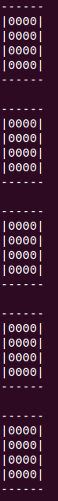
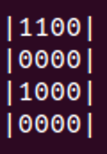

# 0CTF/TCTF 2021 Quals FA51R_RE & FA51R_PWN WriteUp

- [中文](./README.md)


## Table of Contents

* [0CTF/TCTF 2021 Quals FA51R_RE &amp; FA51R_PWN WriteUp](#0ctftctf-2021-quals-fa51r_re--fa51r_pwn-writeup)
   * [Table of Contents](#table-of-contents)
   * [Basic Information](#basic-information)
   * [Overview](#overview)
   * [Design](#design)
      * [FASLR](#faslr)
      * [Binary Tetris in FA51R_RE](#binary-tetris-in-fa51r_re)
      * [FA51R_PWN](#fa51r_pwn)
   * [Intended Solution](#intended-solution)
      * [FA51R_RE](#fa51r_re)
      * [FA51R_PWN](#fa51r_pwn-1)
   * [List of files](#list-of-files)
   * [Deployment](#deployment)
   * [Solution](#solution)
   * [Others](#others)
   * [Credit](#credit)


## Basic Information

**FA51R_RE**

Rev, 10 solves, 550 points

**FA51R_PWN**

Pwn, 0 solves, 1000 points


## Overview

FA51R means Function level Address Space Layout Randomization (FASLR)。

- _RE: Players need to  reverse binary Tetris game and win the game to pass the first challenge and obtain the admin permission, FA51R_RE flag and password of FA51R_PWN files.
- _PWN: In the admin menu, there are seven functions for malloc, free, show and edit, the visual version of binary Tetris game in \_RE, setting the random number seed, and shutdown the dynamic loading function (although it is not really work).

**Vulnerability location**: When the dynamic loading function is turned off, it will check whether the first parameter of mmap (the address to be mapped) is the same as the return value of mmap (the address actually mapped) to achieve the purpose of Randomization. When they are inequality, it will enter the error handling branch. Two cleanup functions are wrappered in this Error Handling Code, and there is a double free vulnerability.


## Design

### FASLR

The most common ASLR mechanism in Linux uses module as the granularity to perform randomization, and only needs to disclose any address which points to this module, and attackers could use the gadget in it.

- The insight of FASLR is to perform randomization at functions granularity, making attacker needs more information to jump to a valid address when hijacking the control flow.

- The insight of dynamic loading functions is make fewer functions in memory, reducing the number of gadgets which attackers could use.


The workflow of FASLR is as follows:

- mmap FASLR .rodata .bss section when loader is initialized, and `0x300000` is used to store the address of `dyncall`. (`dyncall` is a function in Loader)

- When calling a FASLR function
  - The `caller` needs to set the value of the xmm15 register to the hash of callee and call `*0x300000 `(address of `dyncall` function)
  - `dyncall` randomly select a value from the address space of `0x10000000-0xFFFFFFFF`, and according to the hash in xmm15 `dyncall` load the ` callee` into the specified memory. (A series of complex operations in `dyncall` are used to ensure the correct position of the parameters on the stack, and to replace the return address of the caller with the return address of `dyncall`, so that the cleanup operation in `dyncall` can be executed after the `callee` return)
  - `dyncall` jump to `callee`
  - After returning from the `callee`, `dyncall` will unmap the memory of  `callee`.
  - Return to `caller`


The prototype design of FASLR in this challenge is rough, with many shortcomings such as too high overhead and incomplete randomization.

Related code in `src/loader.c`


### Binary Tetris in FA51R_RE

The verification in FA51R_RE is a binary Tetris game which I designed based on Tetris. The game space consists of 4\*4\*5 bits. There are 5 layers in total, and each layer has 4\*4 bits. Every time a random 4\*4 bit block descent. When all the bits of any row or column in a layer are all 1, the row/column bit is eliminated, the score +1, and the upper layer bit descent. Players can manipulate the 4\*4 dropped block to rotate down or rotate right. When the 1 in a bit of the dropped block overlaps with the 1 in the lower layer, the block stop descend. The game ends when there are blocks on the 5th layer which cannot descent, and when the score exceeds 150 points, you won.

**Game space**（4\*4\*5 layer）：

Randomly generated block：

Block rotate down：

Block rotate right：


After the block descend, if a row or column (1\*4/4\*1 bit) is all 1, the row/column will be eliminated and the score +1.

Victory conditions: higher than 150 points

Failure condition: blocks in first layer cannot descent


### FA51R_PWN

After win the game in FA51R_RE, you can enter the admin mode, which has 7 functions.


- [1~4] New, Edit, Show and Free: A series of operations for heap block, but there are no intended bugs in these operations. Players could use these operations to manipulate the heap layout easily.
- [5] Visual binary tetris game in _RE. Just for fun.
- [6] Allow to set a random seed, which can affect [5] game and mmap address in [7].
- [7] Disable FASLR and dynamically load functions (although it will not really be disabled), the program will load all FASLR functions into random addresses. [Corresponding code](./src/allinone.c#L1266)

The intended bug is a Double Free vulnerability in [Error Handling Code](./src/allinone.c#L1313) when the mmap target address generated by `rand()&0xFFFFF000` does not match the actual mapped address.

The heap used in the FASLR program is a very simple heap allocator [SHMALL](https://github.com/CCareaga/heap_allocator), which has no double free check and can use techniques which similar to fastbin attack to construct arbitrary read and write primitives.


## Intended Solution

### FA51R_RE

- Understand FASLR function loading and calling mechanism and access methods of global variables

- Restore call graph, restore string reference

- Reverse Login logic, a game similar to Tetris, you can win the challenge by reaching 150 points

- Writing scripts to automatically play the game. The probability of winning is depend on the algorithm you used. (You can enumerate sates and add a scoring mechanism, etc.) Since time is used as a seed, the value of the falling block in the game is predictable. (So you also can choose a future time to manually play 150 points? ❌)


### FA51R_PWN

- Analyze seven functions: New, Edit, Show and Free, \_RE's visual version of the game, set the random  seed, disable the dynamic loading function

- There are no intended bugs in the first six functions, the visual game reuses most of the code in _RE.

- You can find that the function of disable dynamic loading function does not actually work. After a careful analysis in the process and found that when the address mapped by `mmap` does not match expected address, it will trigger a double free in error handling.

- [Trigger Double Free]
  - The location of the vulnerability is clarified, and then we need to inject an error to make `mmap` cannot map to the expected address.
  - It is easy to think that when `mmap` is mapping to a mapped address, it cannot be mapped to the expected address correctly.
  - The expected address of `mmap` is generated by `rand()&0xFFFFF000`
  - Therefore, we need to pick a seed so that the return value of next two `rand` are the same after `& 0xFFFFF000`. (map them to a same address, an error occurs, and double free is triggered)

- [Arbitrary  read-write primitive construction] The heap allocator used in the program is a very simple  [SHMALL](https://github.com/CCareaga/heap_allocator), there is no double free check. Use basic fastbin attack technique to construct arbitrary read and write primitives.
- [Getshell] It is found that in `mian`, FASLR's `puts` function will be called to print username. Modify the hash used to identify `puts` in the `main` .data section to the hash of `execve`. Username set to `/bin/sh`, getshell.


## List of files

- ./allinone_noFASLR: no FASLR version. It can be run directly.
- ./allinone_withFASLR_nosplit: FASLR version, but functions has not been splitted.
- ./deployment/FA51R_server/share/admin/main: FA51R server environment, FASLR loader
- ./deployment/FA51R_server/share/admin/: FA51R server environment, enable FASLR and functions be splitted to single files.
- [./func_hash.txt](./func_hash.txt): Correspondence between function name and hash


## Deployment

```
cd deployment
cd FA51R_server
docker-compose up -d --build
```


## Solution

- final.py: solver for \_RE and \_PWN
- tetris_solver.py: solver for \_RE
- pwn.py: exploit for \_PWN

```
cd solver
python3 final.py
```


## Others

I considered based on llvm pass and codegen at first, but considering that glibc does not support llvm compilation, so I abandoned this solution.

However, since there were too many corner cases in glibc, it was difficult to handle, so [SHMALL](https://github.com/CCareaga/heap_allocator) and various syscall wrappers were used instead.


## Credit

Thanks to [@Pyro](https://github.com/Le0nn), [@YZloser](https://github.com/YZloser), [@hzqmwne](https://github.com/hzqmwne) for testing this challenge and provide suggestions and help.